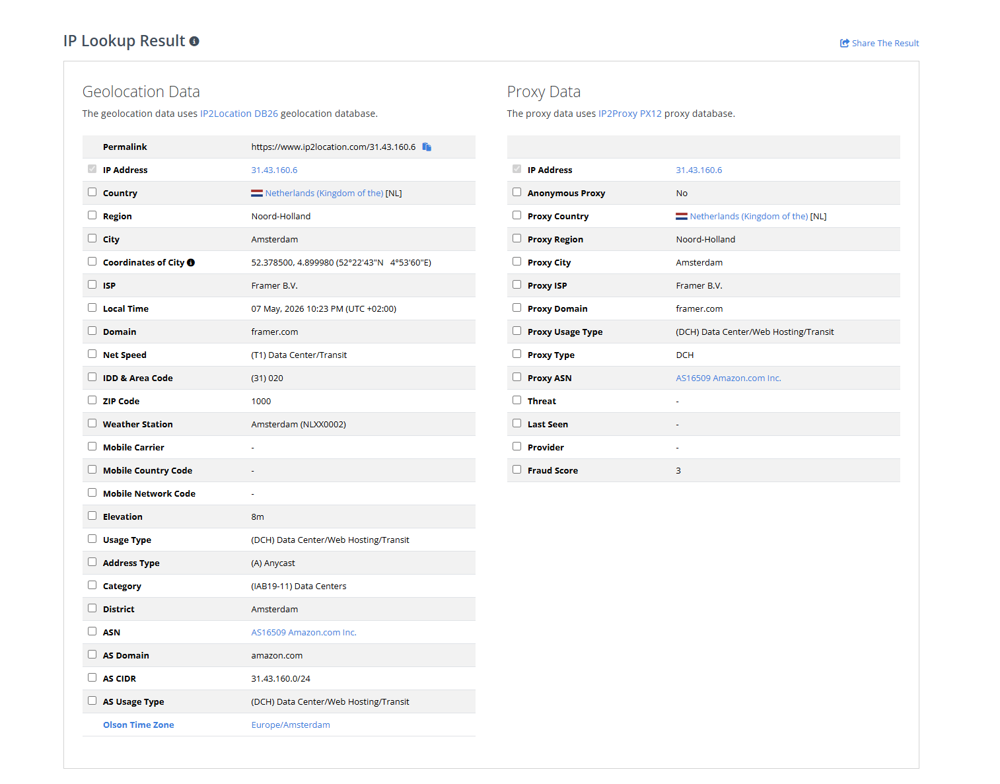
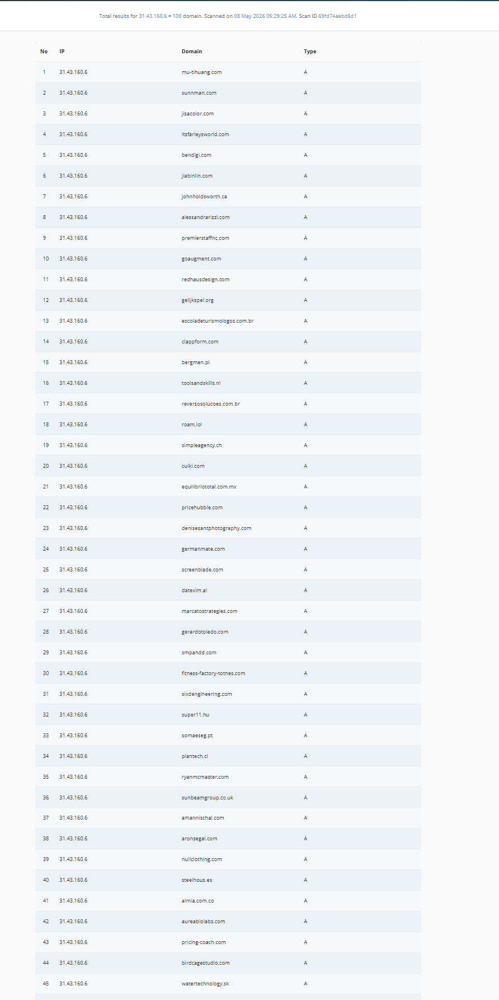

# CTI Investigation: The WeFi.co "Deobank" Infrastructure & Network Analysis
**Author:** Angelo / Soleil  
**Date:** May 14, 2026  
  

## 1. Executive Summary
This dossier details the infrastructure, operational security (OPSEC), and deceptive financial engineering employed by **WeFi.co**. While presenting as a regulated "Global Deobank" with over 200,000 users, technical analysis reveals a sophisticated, decentralized fraudulent network. 

**Key Intelligence Discovery:** Technical attribution traces the project’s core authentication and communication backend directly to **Mumbai, India**. The operation utilizes "Scam-as-a-Service" templates and aggressive legal posturing to maintain a façade of legitimacy while operating a liquidity-trapped ecosystem.

## 2. Infrastructure Layer & Geolocation Analysis
The network architecture is deliberately fragmented across multiple jurisdictions to evade simple legal attribution and complicate international law enforcement coordination.

### 2.1 The "Front-End" Shell (Netherlands/USA)
The primary landing page resolves to **31.43.160.6**, hosted via **Framer B.V.** in Amsterdam. 
* **Tactical Observation:** Legitimate financial institutions utilize enterprise-grade CDNs (Akamai, Cloudfront) with proprietary code. The use of a "No-Code" designer tool like Framer indicates a "visual-only" shell with no integrated banking backend.
* **Hosting Density:** Reverse IP lookups show the server hosts hundreds of unrelated domains, indicating a lack of dedicated security infrastructure.

### 2.2 The "Mumbai Hub" (India)
The critical operational logic—specifically the login (`auth.wefi.co`) and user dashboard (`app.wefi.co`)—is hosted in the **AWS ap-south-1** (Mumbai) region.
* **The "Smoking Gun":** SSL certificates for these subdomains are hard-linked to **`smsgupshup.dev`**, an Indian SMS gateway used for OTP/2FA delivery. This serves as definitive attribution to the Indian subcontinent for the backend operation.

## 3. Network Fingerprinting: The "Scam-as-a-Service" Angle
Professional CTI analysis reveals that WeFi is not a unique startup, but a repeatable template.

### 3.1 Pivot Point: xspacestdg.com
The authentication layer utilizes the identity **`app-as1.xspacestdg.com`**. This domain acts as a "template fingerprint." Threat actors frequently reuse the same authentication servers for multiple "clone" scams. By tracking `xspacestdg.com`, more equiped researchers can identify "sister" sites that share the same backend, indicating a **"Scam-as-a-Service"** model managed by a single South Asian syndicate.

## 4. Financial Engineering & Capital Extraction
The documentation reveals several mathematical traps designed to prevent capital exit.

### 4.1 Mathematical Insolvency (The Liquidity Gap)
As of May 2026, the $WFI token (BEP-20) claims a theoretical Market Cap of **$177.5M**, yet real-world liquidity in DEX pools is only **$129,500**.
* **Liquidity Ratio:** 0.0007.
* **Implication:** The price is a "Paper Tiger." It is mathematically impossible for even 1% of the holders to exit at the displayed price.

### 4.2 Supply Centralization
91.6% of the total supply is held by a single deployer wallet (`0x904a...`). This provides the actors with total "Rug Pull" capability.

### 4.3 The "Energy" Gating Mechanic (Ponzi Hallmark)
A critical hallmark of this fraud is the **"Energy" Mechanism**. To release tokens, the platform requires "Energy," which can only be generated by "committing" (locking up) more capital. 
* **Ponzi Logic:** This is a classic yield-gating tactic. It forces the injection of new capital to unlock old "gains," effectively preventing a "Bank Run" by making it technically impossible to withdraw without further investment.

## 5. Regulatory Intelligence & The "Shell" Network
**WeFi** utilizes a global network of shell companies to create an "Illusion of Legitimacy."

### 5.1 The MSB Registration Fallacy
WeFi markets its **Canadian MSB registration** (FINTRAC M23563590) as a banking license.
* **Reality:** FinCEN and FINTRAC explicitly state that an MSB registration is **not** an endorsement and does not authorize an entity to act as a bank or offer investment products.
* **Jurisdictional Fragmentation:** The network includes entities in **Hong Kong (Nordpal Holding)**, **Calgary (WeFi Payments)**, and **Costa Rica**, all operating without top-tier financial licenses.

### 5.2 Official Prohibitions
The German regulator **BaFin** issued an official warning in early 2026, documenting the illegality of the platform’s financial offers.

## 6. Legal Aggression: The "Kulikoff" Defense
To suppress research, the project utilizes aggressive legal posturing.
* **The Shield:** A "Swiss boutique law firm" (**PLL Legal & CBP**) and lawyer **Pavel Kulikov** have issued Cease and Desist notices to critics like Danny de Hek.
* **False Representations:** These notices claim the business is "authorized by the Bank of Canada"—a claim that is fundamentally false, as the Bank of Canada does not authorize private fiat-to-crypto businesses.

## 7. Active Threat Intelligence & Victimology
The ecosystem is currently in an "aggressive extraction" phase.

### 7.1 Phishing & Social Baiting
Threat actors utilize high-stakes raffles ($100,000 USDT) and "Airdrop" campaigns to harvest user credentials.
* **Malicious Domain:** `rewards-wefi.co` has been identified as an active phishing domain and has since been shutdown.

/Fig_28_Malicious_Domain_Detection_Report.png)
/Fig_30_Chainabuse_Victim_Loss_Report.png)

## 8. Summary Comparison: Claim vs. Reality

| Metric | WeFi Marketing Claim | Technical CTI Reality |
| :--- | :--- | :--- |
| **Infrastructure** | Global Decentralized Bank | Shared "No-Code" hosting (Framer/Tilda). |
| **Governance** | Community-led / Decentralized | 91.6% Supply Centralization. |
| **Security** | Bank-grade protocols | Standard Cloudflare origin masking. |
| **Regulation** | "Authorized by Bank of Canada" | MSB Registration Fallacy / BaFin Banned. |
| **Location** | Swiss / Canadian / Global | Operational Hub in Mumbai, India. |

## 9. Conclusion & Recommendations
The evidence confirms that WeFi.co is a professionally managed fraudulent operation. It utilizes legitimate services (AWS, Google, Framer) to create a facade that exploits the "trust gap" in decentralized finance.

**Recommendations:**
1. **Financial:** Do not deposit funds. The "Energy" mechanism ensures capital cannot be easily withdrawn.
2. **Technical:** Block the `31.43.160.6` IP and `*.wefi.co` subdomains.
3. **Legal:** Report MSB number **M23563590** to FINTRAC for misuse of registration credentials.

You can see more photo proof from the sub folder **WeFi.**  
Thank you for reading.
