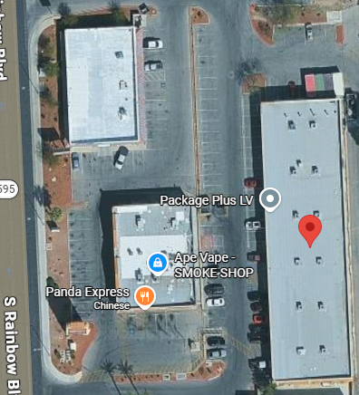
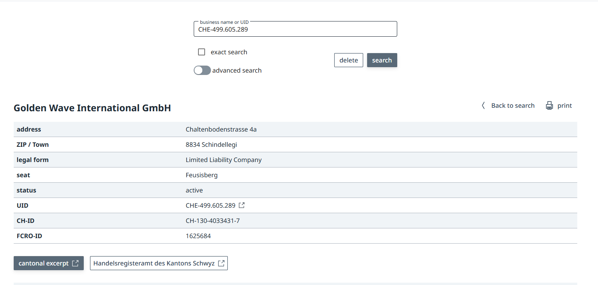
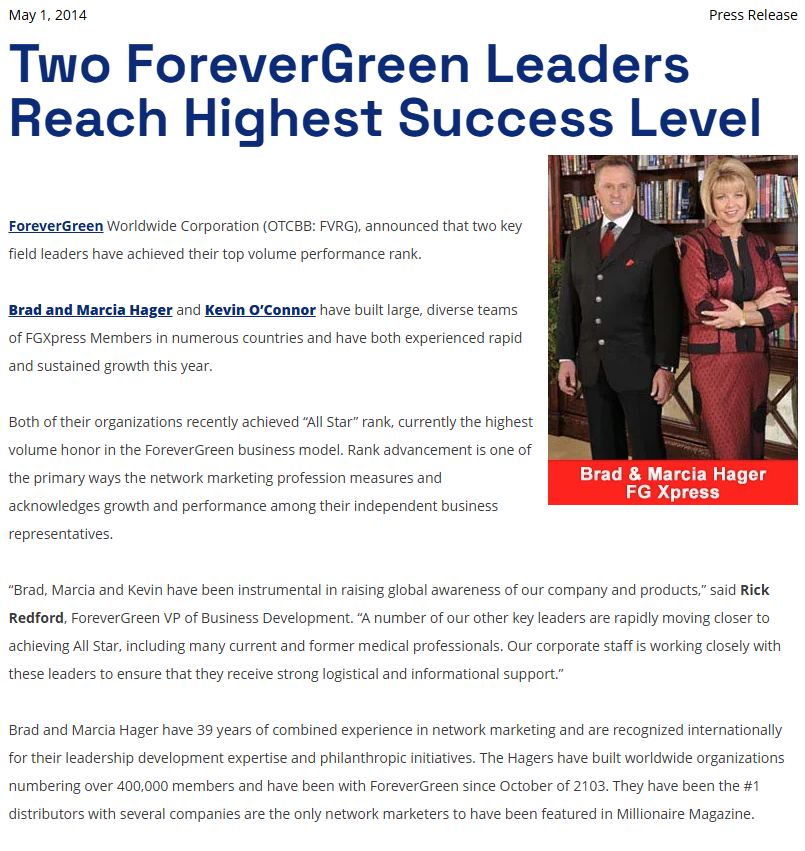
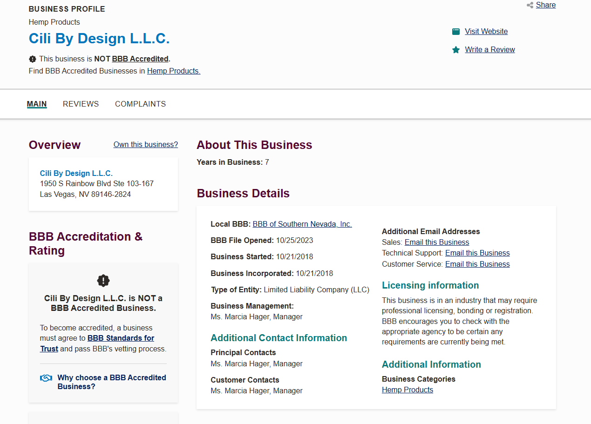
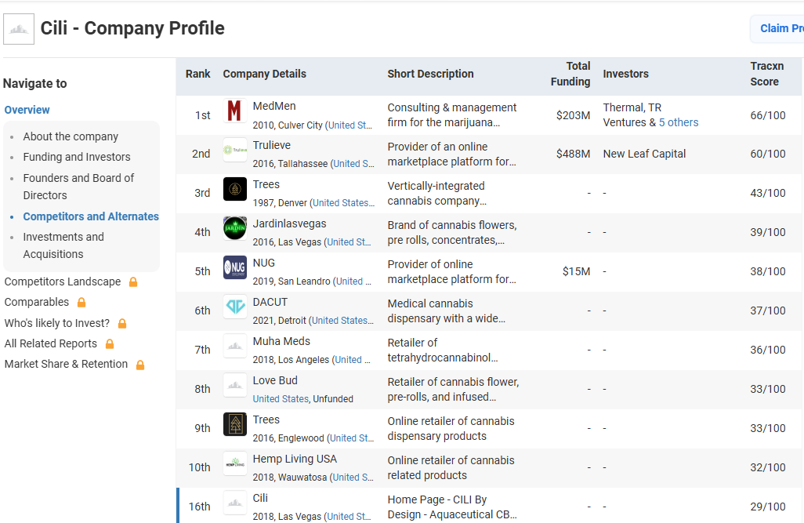
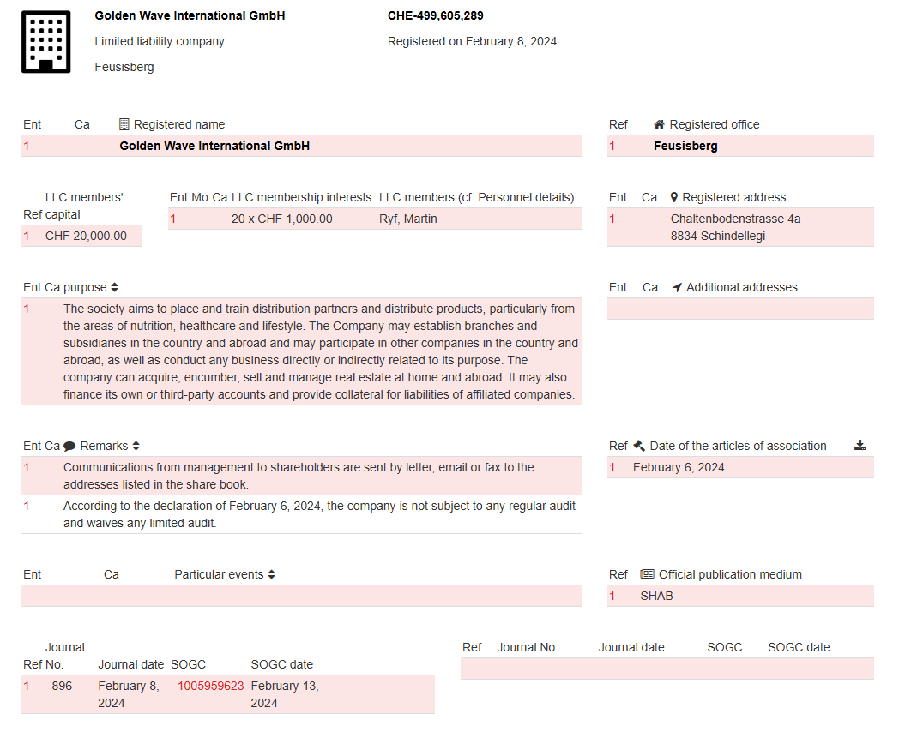
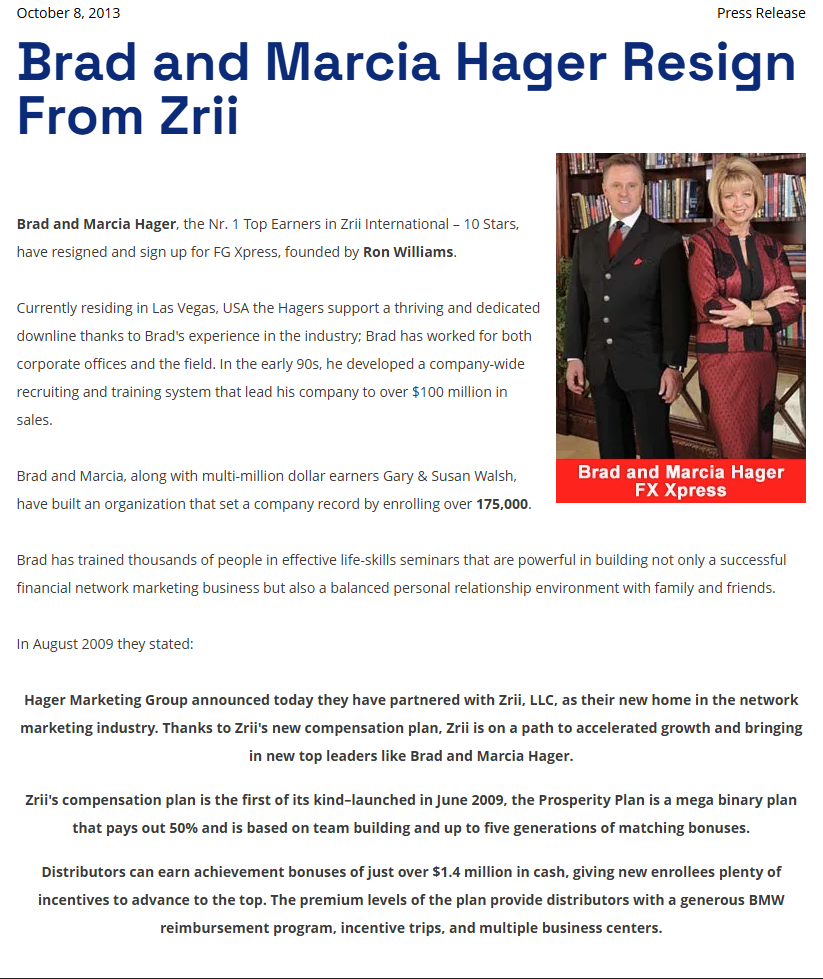
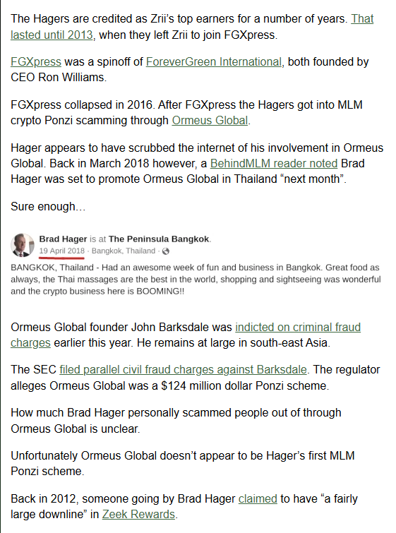
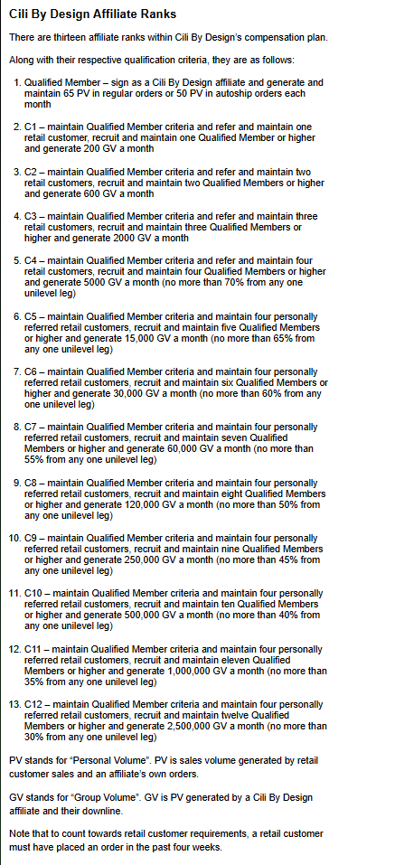
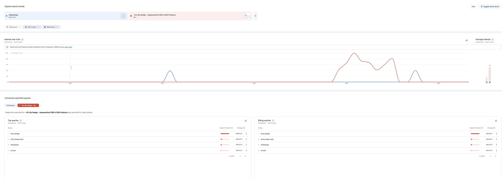

# Investigative Report: CiLi by Design & The Hager Network

**Target of Investigation:** CiLi by Design LLC / Golden Wave International GmbH  
**Key Principals:** Brad Hager, Marcia Hager  
**Sector Focus:** CBD Supplements and Multi-Level Marketing (MLM)  
**Date:** May 15, 2026  
**Author:** Angelo/Soleil

## 1. Executive Summary

CiLi by Design operates within the highly saturated Multi-Level Marketing (MLM) niche for CBD supplements. Officially launched in 2019, the company projects the image of a massive, scientifically advanced global operation. However, an in-depth analysis of their corporate structure, marketing claims, and the historical background of its founders reveals a fundamentally different reality. 

This report analyzes the legitimacy of CiLi by Design and its European operational branch, Golden Wave International GmbH. The findings indicate a heavy reliance on pseudoscientific marketing, deliberate corporate opacity utilizing Swiss audit loopholes, and a compensation structure designed to prioritize internal recruitment over actual retail sales. Furthermore, the founders possess a highly documented history of migrating recruitment networks through collapsed MLM structures, including verified ties to a massive cryptocurrency Ponzi scheme indicted by the SEC.

## 2. Corporate Shell Analysis and Physical Infrastructure

Despite marketing materials highlighting advanced laboratories and global headquarters, the actual physical footprint of CiLi by Design reveals significant inconsistencies.

### 2.1 The United States Virtual Operations
The company lists its primary United States corporate addresses as 1950 S Rainbow Blvd, Ste 103-167, and 8465 W Sahara Ave, Ste 111-106, located in Las Vegas, Nevada. Cross-referencing these addresses on public directories and mapping services reveals that they do not belong to corporate offices or scientific laboratories. Instead, they correspond to commercial mail-receiving agencies (CMRAs) such as Pack Ship & More and PostalAnnex+. 

A legitimate enterprise generating millions of dollars in revenue and employing a purported team of nine PhD scientists does not run its core operations out of shared, virtual private mailboxes (PMBs) located in suburban strip malls. This suggests the Las Vegas address is merely a shell registration used to project a corporate presence.

### 2.2 The Swiss Audit Exemption: A Shield Against Transparency
European operations are managed through Golden Wave International GmbH (UID: CHE-499.605.289), registered at Chaltenbodenstrasse 4a, Schindellegi, Switzerland. This address functions as a shared corporate domicile housing at least 41 other distinct companies.

Under Article 727a, paragraph 2 of the Swiss Code of Obligations, Golden Wave International GmbH has legally filed for an "opting-out" of a formal financial audit. This legal provision allows companies with fewer than 10 full-time employees to dispense with an independent financial review, provided all shareholders agree. 

While this maneuver is strictly legal, it serves as an impenetrable barrier against financial transparency. Top distributor Martin Ryf has openly claimed earnings of three million dollars through the platform. In the standard MLM industry, legitimate companies provide evidence of such massive payouts by submitting to independent audits. By choosing the opting-out path, Golden Wave ensures its bank balances, tax payments, true profit margins, and actual distributor earnings remain entirely hidden from the public. 

## 3. The Founders' History: MLM Nomads and Ponzi Schemes

According to their official corporate biographies, Brad Hager has been involved in the MLM industry for 28 years, and Marcia Hager is credited with joining the industry in her early twenties. Operating primarily under the "Hager Marketing Group," their historical footprint reveals a classic "MLM Nomad" pattern. They construct massive recruitment downlines, extract the maximum possible capital, and exit just before the network collapses or faces regulatory scrutiny.

### 3.1 Historical MLM Timeline
* **Vitamark (Early 2000s):** The Hagers reached the top ranks before the company's eventual decline.
* **Cyberwize to Zrii (2009 to 2013):** The Hagers abandoned Cyberwize and migrated their downline to Zrii, becoming the top earners. They abandoned this network in 2013 amidst corporate turmoil.
* **ForeverGreen and FGXpress (2013 to 2016):** They moved their massive downline into FGXpress, a spinoff of ForeverGreen International founded by CEO Ron Williams. FGXpress ultimately collapsed in 2016.
* **Zeek Rewards (2012):** Archival data from 2012 shows an individual named Brad Hager boasting of a "fairly large downline" in Zeek Rewards. Zeek Rewards was a notorious North Carolina-based scheme run by Paul Burks. Brad Hager's social media confirms he is originally from North Carolina, strongly linking him to this collapsed operation.

### 3.2 The Ormeus Global Cryptocurrency Ponzi
Following the collapse of FGXpress, the Hagers transitioned into the realm of cryptocurrency MLM scams through a company called Ormeus Global. 

In early 2018, independent researchers noted that Brad Hager was actively promoting Ormeus Global in Thailand. By 2019, Ormeus Global collapsed entirely. Its founder, John Barksdale, was arrested by Thai authorities and subsequently indicted on criminal fraud charges in the United States. The SEC filed parallel civil fraud charges, officially classifying Ormeus Global as a 124 million dollar Ponzi scheme. John Barksdale remains at large as a fugitive in Southeast Asia.

Brad Hager has seemingly attempted to scrub his digital footprint regarding his involvement with Ormeus Global. Tellingly, CiLi by Design was launched in 2019, the exact same year Ormeus Global was dismantled by international authorities.

## 4. Product Viability and the "Aquaceutical" Fallacy

CiLi by Design attempts to differentiate its products in an extremely competitive CBD market using a fabricated marketing term: "Aquaceutical Cellular Nutrition Technology." The company asserts this technology was perfected by a team of four scientists holding nine PhDs.

### 4.1 The Product Lineup and Pricing Discrepancy
The company markets a range of CBD and CBG supplements that are significantly overpriced compared to standard market alternatives.
* **Cili Swish:** Retails at $72.50 for a bottle containing 36 servings. This is the flagship product, described as the purest hemp oil on the market.
* **Cili Boost:** Retails at $25.00 for 90 spray servings. Marketed as an orange zest energy spray.
* **CILI Sleep / Serenity / Relief / Trim:** Each retails at $25.00 for 30 spray servings.

The flagship Swish product contains 3326 mg of THC-free hemp oil and 1232 mg of a "proprietary aquaceutical adaptogen nootropic wellness blend." The lack of retail pricing viability strongly suggests these margins exist solely to fund the MLM compensation plan, making retail sales nearly impossible and forcing the business model to rely entirely on internal affiliate consumption.

### 4.2 Deconstructing the Pseudoscience
The marketing material utilizes complex "Science-Slam" terminology designed to impress ordinary consumers, but it falls apart under basic chemical scrutiny.

**1. Breaking Covalent Bonds:** The marketing claims their technology can "break covalent bonds between hydrogen and oxygen." A covalent bond is the fundamental force holding a water molecule together. If these bonds are chemically broken, the result is hydrogen gas and oxygen gas, a process known as electrolysis. It does not create a highly absorbable drinkable liquid supplement.
**2. Erasing Water Memory:** The website claims to "erase water memory." This is an esoteric, homeopathic concept that has been widely discredited and has absolutely no basis in modern physics or chemistry.
**3. The 7 Nanometer Math Error:** The marketing materials claim their particles are 7 nanometers (nm) in size, explicitly stating this is "close to the picometer threshold." This is mathematically impossible. One nanometer equals 1,000 picometers. Therefore, 7 nm equals 7,000 picometers. Claiming that 7,000 is close to 1 is a massive distortion. To provide physical context, atoms themselves are measured in picometers.
**4. Trademark vs. Utility Patent:** A search of the USPTO (Application #97793057) confirms that "Aquaceutical" is merely a pending trademark wordmark. It is not a utility patent protecting a unique or proprietary scientific process. 

[Click here to view the USPTO Aquaceutical Trademark Filing PDF](../CilibyDesign/Fig_05_USPTO_Aquaceutical_Trademark_Filing.pdf)

### 4.3 The Certificate of Analysis (COA) Misdirection
CiLi by Design utilizes a specific misdirection regarding its product testing. There are two types of Certificates of Analysis in the supplement industry. CiLi displays the "Isolate COA," which is simply the laboratory test of the raw, bulk white powder purchased from a third-party supplier. This only proves the raw material was clean before processing. 

What is suspiciously missing is the "Finished Product COA." Once the raw isolate is mixed with water and 90 different herbal ingredients, the chemistry fundamentally changes. Without a finished product test, consumers have no proof of actual CBD potency after dilution, no proof regarding heavy metal or pesticide contamination from the 90 added plants, and no proof of chemical stability to ensure the CBD does not simply separate and clump at the bottom of the bottle.

### 4.4 The Association Sophism and Regulatory Dangers
The company employs a marketing technique known as association sophism. They link general, real-world studies on the benefits of hemp to validate their specific, untested product. None of the scientific studies cited in their literature actually mention "CiLi by Design" or "Aquaceutical Technology." A legitimate scientific enterprise would provide peer-reviewed clinical trials conducted directly on their specific finished formula.

Furthermore, CiLi utilizes highly non-compliant terminology, marketing products for "Relief" from pain and "Serenity" for anxiety. In October 2019, the FDA and FTC issued massive joint warnings to CBD companies, such as Relievus, for making these exact unapproved health claims regarding pain, anxiety, and inflammation. CiLi operates within this exact same regulatory danger zone.

## 5. The MLM Compensation Plan: A Focus on Recruitment

The true operational focus of CiLi by Design is revealed in its compensation structure. The plan is a hybrid unilevel and binary system that heavily incentivizes recruitment and mandatory autoships over genuine retail sales to the public.

### 5.1 Rank Qualifications and Autoship Requirements
There are thirteen distinct affiliate ranks, starting at Qualified Member and scaling up from C1 to C12. To remain active in the system, a member must generate 65 Personal Volume (PV) through regular orders or maintain a 50 PV autoship order each month. 

As stated in an official marketing video: "One bottle of Swish on your monthly order is all it takes to satisfy your volume requirements to earn all bonuses." This explicit focus on autoship traps affiliates in a monthly fee cycle, ensuring revenue continues to flow upward regardless of retail success.

### 5.2 The 13 Tier Rank Structure
The requirements to climb the ranks reveal a stark disparity between retail customers and recruited affiliates.
* **Lower Tiers (C1 to C3):** Ranks C1 through C3 require generating between 200 and 2,000 Group Volume (GV) per month and maintaining one to three retail customers.
* **Mid to Upper Tiers (C4 to C11):** The requirements scale exponentially. C8 requires 120,000 GV and eight recruited members.
* **The Top Tier (C12):** To reach the absolute top rank, an affiliate must generate a staggering 2,500,000 GV per month and recruit twelve active affiliates. However, they are still only required to maintain four retail customers. 

This 3 to 1 disparity at the highest level definitively proves the system is mathematically designed around building massive downlines rather than acquiring external retail consumers.

### 5.3 Commission Caps and Unilevel Retail Payouts
Retail commissions are paid via a unilevel structure, placing the affiliate at the top and paying down four theoretical levels. 
* Affiliates earn 25% on level 1 (personally referred customers).
* C1 earns 25% on level 1 and 10% on level 2.
* C2 adds 5% on level 3.
* C3 and higher add 5% on level 4.

However, the residual commissions paid via the binary structure are severely capped at the lower levels, which lopsidedly punishes the majority of participants. A C2 ranked affiliate is capped at earning a maximum of $500 a month in residual commissions. A C3 is capped at $1000. It is not until C12 that the cap scales up to an impossible $1,000,000 a month. In standard MLM models, the vast majority of affiliates never make it past the opening ranks, meaning their earning potential is strictly throttled while they continue paying their monthly autoship fees.

## 6. Pay-to-Play Mechanics and Arbitrary Bonuses

### 6.1 Regulatory Red Flags: Builder's Packs
Basic affiliate membership costs $39.95 annually. However, CiLi by Design offers optional "Builder's Packs" that effectively allow users to purchase a higher rank and bypass the initial organic growth phase.
* **Consumer Pack:** Costs $89.
* **Intro Pack:** Costs $299.95 and explicitly grants the user the C3 rank for 30 days.
* **Networker Pack:** Costs $599.95 and grants the C4 rank for 60 days.
* **Pro Pack:** Costs $899.95 and grants the C5 rank for 90 days.

Regulatory agencies strongly warn against MLM operations where participants can purchase expensive inventory packs to artificially inflate their compensation rank. This "Pay-to-Play" structure is a primary hallmark of unsustainable pyramid mechanics.

### 6.2 The Illusion of Redundant Bonuses
CiLi boasts multiple avenues for income, including specific lifestyle rewards:
* **Car & Transportation Bonus:** Pays between $100 to $1200 a month depending on rank.
* **Travel & Expense Account:** Pays between $250 to $10,000 a month.
* **Healthcare & Insurance Bonus:** Pays between $350 to $1200 a month.

Despite the highly specific names, the company's own fine print clearly states these are simply cash bonuses that affiliates can spend "any way you want" or "at their discretion." Splitting standard cash payouts into arbitrarily named categories is a deceptive marketing tactic utilized purely so the company can claim there are "10 different ways to earn money in CiLi." 

## 7. Market Position and Tracxn Rating

An objective look at the company's market health reveals a stagnant enterprise. Tracxn, a recognized market intelligence platform, scores CiLi by Design at an abysmal 29 out of 100. This score classifies the operation as an unfunded "Zombie Company," indicating zero outside venture capital investment, stagnant hiring trends, and extremely low web authority. CiLi ranks 16th out of 605 competitors in its sector, directly contradicting leadership claims of massive global expansion.

## 8. Conclusion

The operational footprint of CiLi by Design heavily indicates a legally insulated recruitment structure masquerading as a pioneering biotech entity. The products are fundamentally uncompetitive in the current retail CBD market due to inflated pricing, forcing affiliates into a cycle of internal consumption via mandatory monthly autoships. 

When analyzing the founders' highly documented history with collapsed networks and the SEC-indicted Ormeus Global Ponzi scheme, alongside the use of regulatory-evading Swiss accounting practices and chemically impossible scientific claims, CiLi by Design presents severe financial risks. 

In the complete absence of a published Income Disclosure Statement (IDS), it is mathematically highly probable that the vast majority of participants lose money through monthly fees and Builder's Packs, directly funding the commissions of the top-tier recruiters like Brad Hager and Martin Ryf.

## 9. Source Documentation and Reference Links

The following public records and primary sources validate the findings within this report:

1.  **The Swiss Audit Evasion:** [Zefix Official Registry (CHE-499.605.289)](https://sz.chregister.ch/cr-portal/auszug/auszug.xhtml?uid=CHE-499.605.289#)
2.  **Federal Regulatory Precedent:** [FTC/FDA Joint Warning Letter (Oct 22, 2019 - PDF)](https://www.ftc.gov/system/files/attachments/press-releases/ftc-fda-warn-florida-company-marketing-cbd-products-about-claims-related-treating-autism-adhd/cbd_warning_letter_10-22-19.pdf)
3.  **The MLM Nomad History:** [Business For Home Report - "Two ForeverGreen Leaders"](https://www.businessforhome.org/2014/05/two-forevergreen-leaders-reach-highest-success-level/)
4.  **The "Zombie" Market Ranking:** [Tracxn Market Intelligence - CiLi by Design](https://tracxn.com/d/companies/cili/__TCyfEQ2rR0RkMUPKrKeq1ZPBmghayi_0TOL3sxGaftI)
5.  **The US Shell Registration:** [BBB Official Profile - Cili By Design L.L.C.](https://www.bbb.org/us/nv/las-vegas/profile/hemp-products/cili-by-design-llc-1086-90090945)
6.  **Scientific Obfuscation Check:** [CodeCheck Ingredient Analysis](https://www.codecheck.info/p/lebensmittel/medizinische-produkte-nahrungsergaenzung/weitere-nahrungsergaenzungen/2842261737.html)
7.  **Trademark Reality:** [USPTO Trademark Search (97793057)](https://tmsearch.uspto.gov/search/search-results/97793057)
8.  **Public Leadership Challenges:** [Jason Calacanis Confronts Clubhouse MLM Masters](https://www.youtube.com/watch?v=iy9t3dfIlZo)
